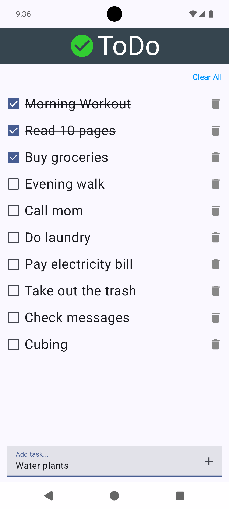
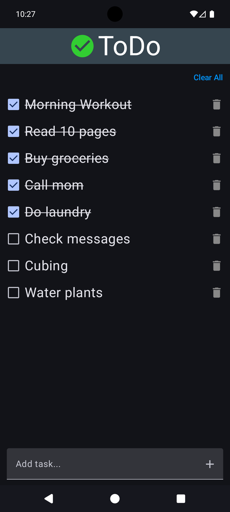

# ToDo — A Simple & Modern Todo App for Android

[](https://kotlinlang.org/)
[](#)
[](LICENSE)

**ToDo** is a clean and minimal todo application built with **Jetpack Compose**, a robust **MVVM architecture**, and **Room** for local data persistence, focusing on simplicity, smooth interactions, and modern Android best practices with full support for **light and dark themes**.

---

## 📸 Screenshots

|                   Light Mode                    |                   Dark Mode                   |
|:-----------------------------------------------:|:---------------------------------------------:|
|  |  |

---

## ✨ Features

- **Add Tasks:** Quickly add new todo items
- **Check / Uncheck Tasks:** Mark tasks as completed or pending
- **Delete Tasks:** Remove individual todo items
- **Clear All Tasks:** Delete all todos with a single action
- **Persistent Storage:** Todos stored locally using **Room**
- **Light & Dark Mode:** Automatic theme switching
- **Smooth UX:** Proper focus handling and keyboard dismissal

---

## 🛠 Tech Stack & Architecture

- **UI:** 100% **Jetpack Compose**
- **Architecture:** **MVVM** (Model–View–ViewModel)
- **Database:** **Room**
- **State Management:** `State`, `Flow`, lifecycle-aware state collection
- **Theming:** **Material 3**
- **Language:** Fully written in **Kotlin**

---

## 🧱 Architecture Overview

```text
UI (Jetpack Compose)
        ↓
    ViewModel
        ↓
    Repository
        ↓
   Room Database

```
## 🚀 Build & Run

### Prerequisites

-   Android Studio (latest stable version)
-   JDK 17 or higher

### Installation

1.  **Clone the repository:**
    ```sh
    git clone https://github.com/Gaurav12480/ToDo.git
    ```
2.  **Open in Android Studio:**
    -   Open the project in Android Studio.
    -   Let Gradle sync all the project dependencies.
3.  **Run the app:**
    -   Select an emulator or a physical device.
    -   Click the "Run" button.

## 📄 License

This project is licensed under the **MIT License**. See the [LICENSE](LICENSE) file for details.